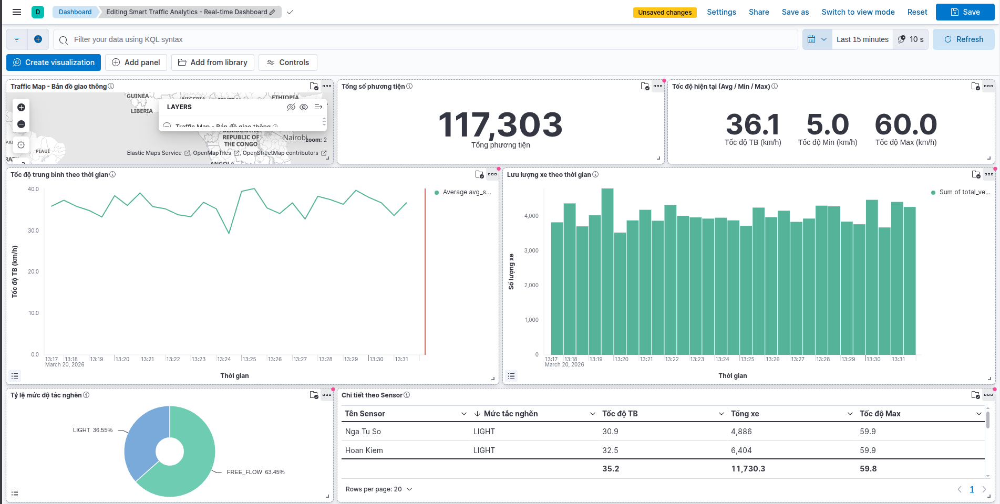

# Smart Traffic Analytics

Traffic analytics system built on a Lambda Architecture model:

- Speed Layer (real-time): Kafka -> Flink -> Kafka -> Elasticsearch -> Kibana
- Batch Layer (historical): Kafka -> MinIO (raw) -> Spark -> MinIO (processed) + PostgreSQL

## 1) High-Level Architecture

```
Traffic Simulator
     |
     v
Kafka topic: traffic-raw
     |                         
     +--> Flink Speed Layer --> Kafka topic: traffic-processed --> Elasticsearch --> Kibana
     |
     +--> Kafka to MinIO (raw JSON)
                 |
                 v
            MinIO bucket: traffic-raw-data
                 |
                 v
            Spark Batch Layer (ETL + aggregate)
                 +--> MinIO bucket: traffic-processed-data (Parquet)
                 +--> PostgreSQL (traffic_agg_hourly / daily / area)

    Airflow (scheduler/orchestrator)
        |
        +--> Trigger DAG `traffic_batch_pipeline` (@hourly)
               |
               +--> Run `src/batch/spark_batch_layer.py`
```

## 2) Technologies

| Component | Technology |
|---|---|
| Message Broker | Apache Kafka |
| Streaming | Apache Flink (PyFlink) |
| Batch | Apache Spark (PySpark) |
| Data Lake | MinIO (S3-compatible) |
| Search/Visualization | Elasticsearch + Kibana |
| Relational DB | PostgreSQL |
| Orchestration | Docker Compose + Apache Airflow |

## 3) Project Structure

```
smart-traffic-analytics/
├── airflow/
│   ├── dags/
│   │   └── traffic_batch_pipeline.py
│   ├── logs/
│   └── plugins/
├── docker/
│   ├── docker-compose.yml
│   ├── Dockerfile.airflow
│   └── minio_setup.sh
├── src/
│   ├── producers/
│   │   └── traffic_producer.py
│   ├── ingestion/
│   │   └── kafka_to_minio.py
│   ├── streaming/
│   │   ├── flink_speed_layer.py
│   │   └── kafka_to_elasticsearch.py
│   ├── batch/
│   │   └── spark_batch_layer.py
│   ├── dashboard/
│   │   ├── setup_kibana_dashboard.py
│   │   ├── import_dashboard.py
│   │   ├── kibana_objects.json
│   │   └── DASHBOARD_GUIDE.md
│   └── utils/
│       ├── config.py
│       └── logger_utils.py
├── requirements.txt
└── README.md
```

## 4) Environment Setup

Requirements:

- Docker + Docker Compose
- Python 3.10+

Install Python dependencies:

```bash
pip install -r requirements.txt
```

Start infrastructure:

```bash
cd docker
docker compose up -d
```

Start or rebuild Airflow services (required after Dockerfile/requirements changes):

```bash
cd docker
docker compose up -d --build airflow-init airflow-webserver airflow-scheduler airflow-triggerer
```

Service ports:

- Kafka: `localhost:9092`
- MinIO API: `localhost:9000`
- MinIO Console: `http://localhost:9001`
- Elasticsearch: `http://localhost:9200`
- Kibana: `http://localhost:5601`
- PostgreSQL: `localhost:5432`
- Airflow UI: `http://localhost:8080` (default `admin/admin`)

## 5) `.env` Configuration

The project loads environment variables from `src/utils/config.py`.

Default values are enough for local runs, but you can override them in `.env`, for example:

```env
KAFKA_BOOTSTRAP_SERVERS=localhost:9092

MINIO_ENDPOINT=localhost:9000
MINIO_ACCESS_KEY=minioadmin
MINIO_SECRET_KEY=minioadmin123
MINIO_BUCKET_RAW=traffic-raw-data
MINIO_BUCKET_PROCESSED=traffic-processed-data
MINIO_USE_SSL=false

POSTGRES_HOST=localhost
POSTGRES_PORT=5432
POSTGRES_DB=traffic_analytics
POSTGRES_USER=traffic_user
POSTGRES_PASSWORD=traffic_pass_123

SPARK_MASTER=local[*]
SPARK_APP_NAME=TrafficBatchProcessor
```

## 6) Run The Full Pipeline

You can run batch in 2 modes.

### 6.1 Manual Mode (5 terminals)

Open 5 separate terminals:

Terminal 1 - Producer:

```bash
python src/producers/traffic_producer.py
```

Terminal 2 - Ingestion Kafka -> MinIO:

```bash
python src/ingestion/kafka_to_minio.py
```

Terminal 3 - Speed Layer Flink:

```bash
python src/streaming/flink_speed_layer.py
```

Terminal 4 - Sink Kafka processed -> Elasticsearch:

```bash
python src/streaming/kafka_to_elasticsearch.py
```

Terminal 5 - Spark Batch Layer:

```bash
python src/batch/spark_batch_layer.py
```

### 6.2 Airflow Mode (recommended for batch scheduling)

1. Start streaming flow:
    - Producer
    - Kafka -> MinIO ingestion
    - Flink speed layer
    - Kafka processed -> Elasticsearch
2. Open Airflow UI at `http://localhost:8080` and enable DAG `traffic_batch_pipeline`.
3. Trigger DAG manually once (or wait for hourly schedule).

The DAG executes:

```text
run_spark_batch_job -> python src/batch/spark_batch_layer.py
```

Notes:
- DAG file path: `airflow/dags/traffic_batch_pipeline.py`
- Airflow containers mount project source at `/opt/project`
- Batch script uses Docker network hostnames (`minio`, `postgres`) from compose env

## 7) Expected Outputs

### 7.1 MinIO

- Raw NDJSON data in bucket `traffic-raw-data`
- Batch Parquet output in bucket `traffic-processed-data`:
  - `batch/cleaned`
  - `batch/agg_hourly`
  - `batch/agg_daily`
  - `batch/agg_area`

### 7.2 PostgreSQL

Aggregate tables written by Spark:

- `traffic_agg_hourly`
- `traffic_agg_daily`
- `traffic_agg_area`

### 7.3 Kibana

After Elasticsearch has data, set up the dashboard:

```bash
python src/dashboard/setup_kibana_dashboard.py
```

Open: `http://localhost:5601`

### 7.4 Demo Screenshot



## 8) Logging

- All modules use the shared logger in `src/utils/logger_utils.py`
- Logs are written to the `logs/` directory

## 9) Quick Troubleshooting

1. Spark warning `hostname resolves to loopback`
    - This is a common local warning and does not block the pipeline.
2. Spark warning `Unable to load native-hadoop library`
    - This is common in local environments and can usually be ignored.
3. Batch layer cannot read from MinIO
    - Check `MINIO_ENDPOINT`, access key/secret, and ensure the raw bucket exists.
4. Batch layer cannot write to PostgreSQL
    - Verify the Postgres container is running and `POSTGRES_*` values are correct.
5. Kibana shows no data
    - Verify `kafka_to_elasticsearch.py` is consuming from the processed topic.

## 10) Useful Commands

Check container status:

```bash
cd docker
docker compose ps
```

View logs for one service:

```bash
cd docker
docker compose logs -f postgres
```

